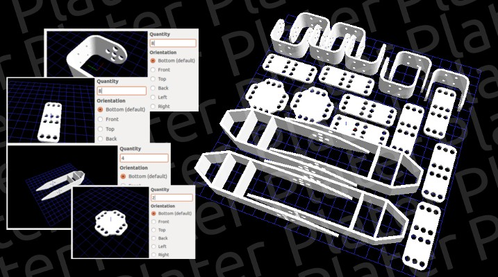

# Plater



Plater is a 3D printer plates placer and optimizer. It takes a few STL files
and some parameters such as the plate dimension, part orientation and spacing,
and it tries to generates 3D model to print your parts with at least as possible
plates.

It uses a really simple configuration file that contains the list of parts with
their quantities and dimension. You can then build your STL plate(s) and release
it with your part, or simply release the `plater.conf` file and let people do
their own plates using their own settings.

Note that Plater will *not* choose the best orientation of a part for you, this is
up to the user because it depends on a lot of things.

* [Get Windows binaries (v1.0)](http://gregwar.com/plater/plater-win32-1.0.zip)
* [Get Linux binaries (v1.0), Qt 4.8 and OpenGL required](http://gregwar.com/plater/plater-linux-1.0.zip)
* [Get OSX dmg (v1.0), thanks to Toby Tomkins](http://gregwar.com/plater/plater-osx-1.0.dmg)

# Using

## With the GUI

To make a plate, first load your STL files. Click "Add Part(s)" button and select
one or more `.stl` file.

This will open a wizard, you'll be able to select the orientation and the quantity
of the part.

Then, enter your plate dimension (in mm). You can also adjust the spacing of the
parts and the precision (internally, plater use a discrete representation of parts,
lower is better).

Hit "Run", this will generate you the STL file(s) corresponding to your plates.

## With the command line

Plater usage is:

```
plater [options] plater.conf
```

Where `plater.conf` is the name of your configuration file. If `-` is given as a
file name, the configuration will be read from standard input.

Here are the options:

* `-v`, increase the verbosity, this will output more things on `stderr` during
  the placing of the parts
* `-W width`, width of the plate, in mm (default `150`)
* `-H height`, height of the plate, in mm (default `150`)
* `-j precision`, precision, in mm (default `0.5`)
* `-s spacing`, parts spacing, in mm (default `2`)
* `-d delta`, sets the spacing of the brute forcing (see below), default `2`mm
* `-r rotation`, sets the angle of the brute forcing, default `90`°
* `-p`, will output .ppm files instead of STLs
* `-o pattern`, sets the pattern of output files, default is `plate_%03d`, this
  means that the first plate will be named plate_001.stl, the second plate_002.stl
  and so on.

# The plater.conf file

The configuration file looks like this:

```
# This is an example of plater.conf file
part.stl 1
other_part.stl 3 back
yet-another-part.stl 8 left
```

Each line begins with a part name, followed by the quantity, and optionally the side
that should be on the plate. The side can be `bottom` (default, you can also put
nothing), `front`, `top`, `back`, `left` or `right.

You can put comment lines begining with `#`, it can be useful to add some advices
on how generate your plate or some copyrights.

The file should be described relatively to the `plater.conf` file.

If a filename contains a space (` `), you can escape it with the \ character (like 
`some\ plate.stl`).

# How does it works?

The problem of placing parts is quite hard and very likely NP-complete. Plater is
an heuristic based on greedy algorithm that use brute force.

Each part is first pixelized into a bitmap (each pixel is white for free space and 
black for used space), with a given precision. Then, this bitmap is dilatated with
a given spacing.

Then, the placer tries to put each part one by one on the plate, brute forcing
position to maximize a score based on a simple gravity-like property, which tend to
pack the parts. If it can't place the part, it try adding a new plate and so on.

It is runned multiple times with multiple parameters, and the best solution, i.e the
one with the less plates is kept.

Note that the result can be bad in some limit cases, and it will not replace your
expert brain! However, it is useful to do the placing automatically and quickly.

# Building

## Plater

To build plater, go in the `plater/` directory and then use the cmake:

```
mkdir build
cd build
cmake ..
make
```

This will create for you the libplater and the plater command tool

## GUI

First, install Qt 4.8.0. Then, be sure you built plater in `plater/build/`.

### Using QtCreator

You can simply run QtCreator on `gui.pro` and build it.

### Using command line

Go in the `gui/` directory, and do:

```
mkdir build
cd build
qmake ..
make
```

This will create the `plater-gui` binary file.
